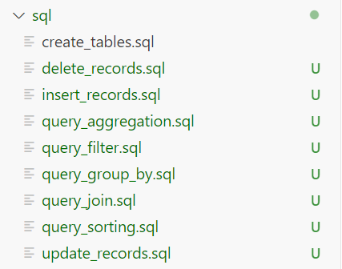
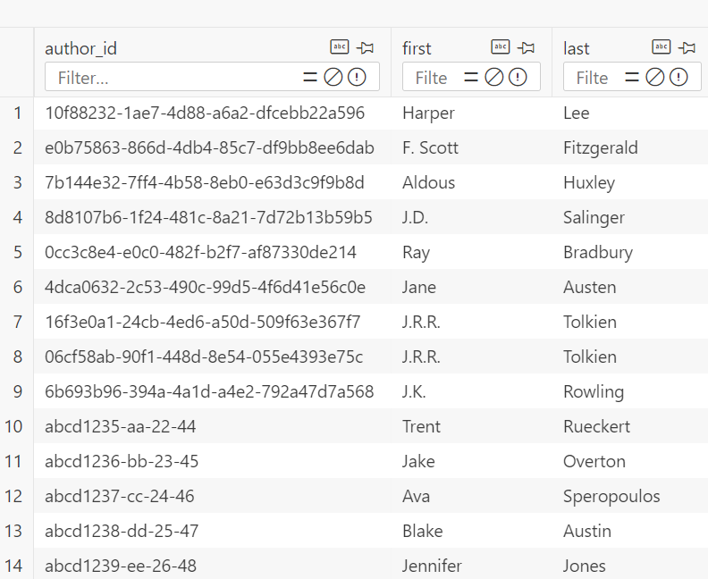
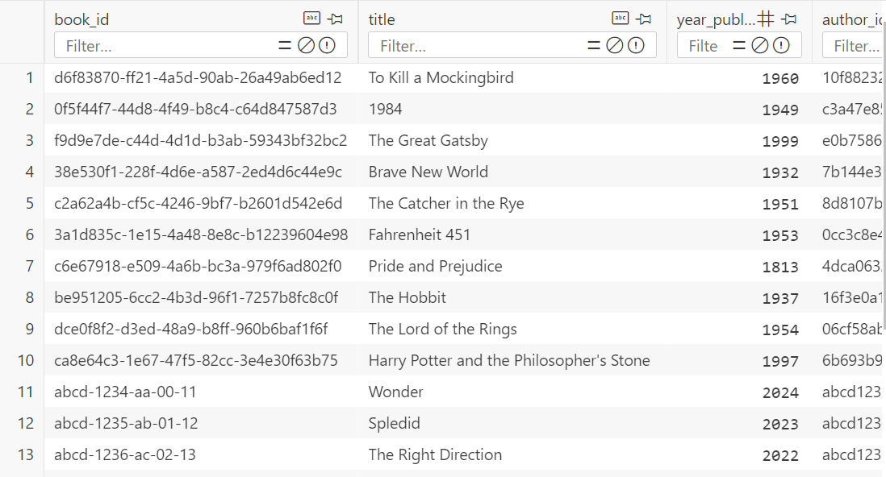

# datafun-05-sql

## Overview

Project 5 integrates Python and SQL, focusing on database interactions using SQLite. This project introduces logging, a useful tool for debugging and monitoring projects, and involves creating and managing a database, building a schema, and performing various SQL operations, including queries with joins, filters, and aggregations.


## Starting the Project: Create and Manage Virtual Project Environment

* Create and name the repository including a default README.md
* Clone it to your machine and include a .gitignore file
* Update the README.md with the process so far
* Use a terminal to add, commit, and push these changes to GitHub


## Commands Used
```
git add .
git commit
git push
git pull
```

## Install packages using requirements.txt
```
pandas
pyarrow
```

## Create Folder/Files and Populate the Initial CSV Files

* Create a folder called 'data'
* Create and add data to two CSVs: authors.csv and books.csv

## Initialize the Database

* Create a Python file called book_manager.py
* Create a folder called sql
* Create a file called create_tables.sql

## Logging 

* import the logging function 
* Configure logging to write to a file, appending new logs to the existing file

## Create More Files in the SQL Folder 

These are used for querying the database

* Create files in the sql folder for:
    * delete_records.sql
    * insert_records.sql
    * query_aggregation.sql
    * query_filter.sql
    * query_group_by.sql
    * query_join.sql
    * query_sorting.sql
    * update_records.sql
    


## Schema Overview

This schema has two tables:
* authors.csv
* books.csv

These two tables contain:
* author_id (primary key), first, last
* book_id, title, year_published, author_id



## Create and Populate the Database
* def create_database(db_path)
* def create_tables(db_path, sql_file_path)
* def insert_data_from_csv(db_path, author_data_path, book_data_path)

## Create the SQL Operations in the Files in the SQL Folder
For all of these, SQL code is used
* insert_records.sql - insert at least 10 additional records into each table
* update_records.sql - update 1 or more records in a table
* delete_records.sql - delete 1 or more records from a table
* query_aggregation.sql - use aggregation functions including COUNT, AVG, SUM
* query_filter.sql - use WHERE to filter data based on conditions
* query_sorting.sql - use ORDER BY to sort data
* query_group_by.sql - use GROUP BY clause (and optionally with aggregation)
* query_join.sql - use INNER JOIN operation and optionally include LEFT JOIN, RIGHT JOIN, etc
* project.db - database file created with Python code

## Execute the SQL Operations with Python Script Through Main() Function
* db_file_path = pathlib.Path("project.db")
* def execute_sql_from_file(db_filepath, sql_file)
* for sql_file in sql_files:
      execute_sql_from_file(db_file_path, sql_file)